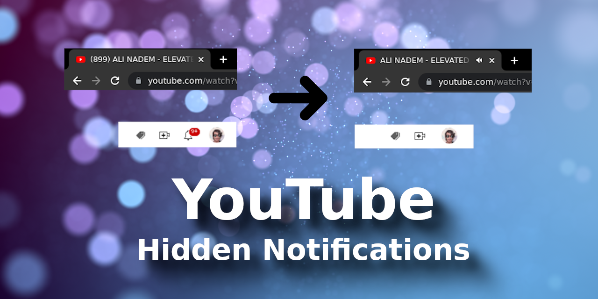

 

    
      
    
    
    
    
    
    

 

Language: <a href="readme.md">EN-US</a>

Toda vez que eu vejo uma notificação, eu saio correndo na direção dela igual um louco pra clicar. Então para não perder mais tempo fazendo isso, fiz esta extensão 🙃

O legal é que posso continuar recebendo notificações na minha aba do Gmail (eu raramente leio essa merda), e mantenho a minha navegação no YouTube limpa.

A extensão oculta o ícone de notificação que fica no topo da página. E remove o contador de notificações que fica no título das páginas no browser.

Para instalar a extensão em seu Google Chrome, basta fazer download dela, e instalá-la manualmente. Se você não sabe instalar uma extensão manualmente, dê uma pesquisada rápida no Google que você resolverá isso rapidamente.

 

:smiley: Autor
---

Patrocinar: [melchisedech333](https://github.com/sponsors/melchisedech333) 
YouTube: [Melchisedech](https://www.youtube.com/channel/UC4Sh4wxncr5arnydpUfWPKw) 
Twitter: [Melchisedech333](https://twitter.com/Melchisedech333) 
Blog: [melchisedech333.github.io](https://melchisedech333.github.io/) 
LinkedIn: [Melchisedech Rex](https://www.linkedin.com/in/melchisedech-rex-724152235/)

 

:scroll: Licença
---

[ BSD-3-Clause license](./license)

  

## Lembre-se de deixar   uma linda estrelinha :star_struck:

